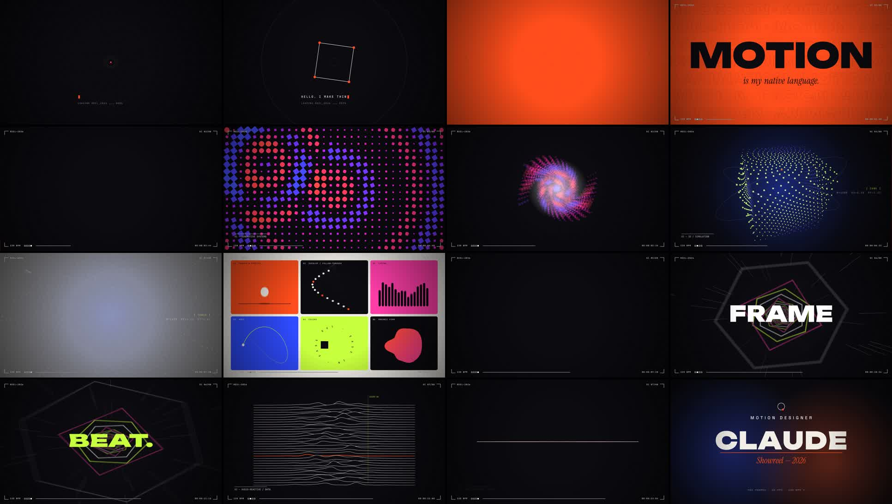

# Procedural motion films

| Film | Length | Folder |
|---|---|---|
| **[Scorpion Bits: brand film](film/README.md)** ▶ [`scorpionbits-film.mp4`](scorpionbits-film.mp4) | 5:00 · 1080p30 | [`film/`](film/) |
| **Motion Reel 2026** ▶ [`showreel.mp4`](showreel.mp4) | 0:15 · 1080p60 | [`reel/`](reel/) |

---

# Motion Reel 2026

A 15-second motion-graphics showreel, built entirely in code.

**▶ [`showreel.mp4`](showreel.mp4)** — 1920×1080 · 60 fps · 15.000 s · stereo AAC



There are no keyframes, stock footage, or samples. Every frame is a pure function of time `t`, and every sound is synthesized sample by sample. Picture and sound share one clock: **128 BPM × 32 beats = exactly 15 s**, one scene per bar.

| Bar | Time | Scene | Techniques |
|---|---|---|---|
| 1 | 0.00 s | **The dot** | elastic pop, beat ripples, a square that draws on and morphs into a circle, typewriter + load counter, an expanding fill used as the cut |
| 2 | 1.88 s | **MOTION** | masked letter reveals with stagger, scrolling outline tickers, 8th-note colour-flip stutter, slice displacement, zoom echo, a 10-bar slice wipe |
| 3 | 3.75 s | **Generative systems** | 576-cell grid driven by interfering beat-triggered ripples, each cell morphing between square and circle, then a swirl collapse |
| 4 | 5.63 s | **3D / simulation** | 1,400-point perspective-projected cloud morphing sphere → cube → torus, orbit rings, scramble readouts, an explosion into a white flash |
| 5 | 7.50 s | **The 12 principles, abridged** | a panel grid that splits 1 → 2 → 4 → 6: squash & stretch, overlap, arcs, easing, timing, organic form, then a staggered exit and an iris wipe |
| 6 | 9.38 s | **Every frame on the beat** | a polygon tunnel that steps forward on every kick, warp streaks, one punched word per beat, a squash down to a single line |
| 7 | 11.25 s | **Audio-reactive / data** | the line splits into a 34-line ridge plot with occlusion and a scanner readout, with a snare-roll build that drives the jitter |
| 8 | 13.13 s | **End card** | the line becomes the underline the name rises out of, tracking-in title, a drawn logo mark, an iris close back to the opening dot |

Global layer: 4-sub-frame motion blur (180° shutter), impact-driven camera shake, RGB split on hits, film grain, vignette, and a HUD (timecode, scene counter, beat lights) that uses `difference` blending so it reads on any background.

## Run it

```bash
cd reel
node audio.mjs          # → soundtrack.wav (synthesized, 128 BPM, A minor)
node render.mjs         # → ../showreel.mp4 (headless Chromium → ffmpeg, ~10 min)
npx serve .             # open index.html for a live, real-time version with sound
```

`render.mjs --stills 1.2,7.9` writes PNG stills, and `--sub 1` gives a fast draft without motion blur.

Fonts (Unbounded, Space Grotesk, JetBrains Mono, Instrument Serif) are under the SIL Open Font License; see `reel/fonts/`.
