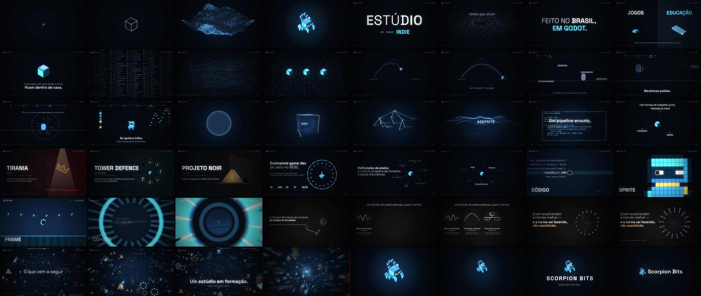

# Scorpion Bits: brand film

**▶ [`scorpionbits-film.mp4`](../scorpionbits-film.mp4)** · 5:00 exactly · 1920×1080 · 30 fps · stereo



This is a 5-minute motion-graphics film about Scorpion Bits, made entirely in code. There is no stock footage, no photos, no screenshots and no audio samples. The only external assets are the studio's official mark (taken unmodified from the website's repository) and the fonts.

Each frame is a pure function of time `t`, rendered in headless Chromium. The soundtrack is synthesized sample by sample from the **same master clock** (`timeline.js`): 96 BPM, one bar = 2.5 s, 120 bars = 300.000 s, and every chapter starts on a bar line. Each visual event that has a sound (a fold, a stamp, a typed character, a hit-stop, a silence) is a single cue that both the picture and the audio read.

## Core idea

*Ideias que viram jogo.* ("Ideas that become games.") The film is built from the studio's own primitive, the **cube / bit** of the isometric scorpion mascot, and keeps transforming one thing into another:

point → line → geometry → tilemap → system → mark · chaos → order · idea → prototype → mechanic → game feel → art & sound → game · input → signal → code → physics → sprite → sound → frame → player · gesture → precision · universe → mark

## Chapters

| # | Time | Chapter | What happens |
|---|---|---|---|
| 01 | 0:00 | Abertura | A point pulses with the sound, stretches into a waveform, folds into a square, and turns in 3D until it settles into the exact isometric brand cube. The cube multiplies into a living voxel tilemap. Every cube then flies home to become one *bit* of the official mark. A light sweep follows, then the wordmark, and the mark flies into the corner HUD. |
| 02 | 0:25 | O Estúdio | **ESTÚDIO** drops in on springs, its variable-font weight rippling. *de jogos* is typed, then **INDIE** is stamped. *Ideias* dissolves into 3,400 particles that swirl and reassemble as **jogo.**, and its period pops into a cube. *Feito no Brasil, em Godot.* enters with slice displacement. A split screen shows games \| education. The four disciplines orbit a cube and move inside it. |
| 03 | 0:55 | O Problema | A wall of half-finished features (generic feature creep, not the studio's projects) becomes a tangled dependency network with conflicts. A scanning beam puts it in order. Everything drops away except three polished cubes. One mechanic is then tested twelve times until the jump arc is *obvious*. |
| 04 | 1:25 | O Método | A pipeline you watch: IDEIA → PROTÓTIPO → MECÂNICA → GAME FEEL → ARTE & SOM → JOGO. A sketch becomes a greybox, then physics debug, then the four game-feel words acted out; for **pausa de impacto** the film itself freezes for 6 frames with the sound cut. A sprite is painted row by row on the notes of a piano roll, and the stages end in a playable-looking game. |
| 05 | 1:55 | Tecnologia | One continuous 3D camera move through 4,000 points: sphere → cube → Godot scene tree (real node types) → sound surface → GDScript interface → particle stream, with depth of field. The real toolset flies through as 3D type. |
| 06 | 2:25 | O Que Fazemos | The three ways to work, then the real state of each project, each with its own visual language: Tirania, AstroDash, Tower Defence, Sitis and Projeto noir. GameLab at SESC follows with its published figures, Tirania's origin in the course, then partnerships. Everything connects into one ecosystem. |
| 07 | 3:05 | Sistema em Movimento | An impossible continuous zoom: each stage lives inside the bit of the one before. INPUT → SINAL → CÓDIGO → FÍSICA → GAME FEEL → SPRITE → SOM → FRAME → JOGADOR → INPUT again. It accelerates to a peak, then cuts: silence, black, one point. |
| 08 | 3:40 | Pessoas | Warm and slow, with no drums. A pen writes a fingerprint. Four people get four fronts, each a hand-drawn imperfect gesture that a precise line then traces. The *roda* of 17 students follows, each one *making* rather than watching. |
| 09 | 4:10 | O Que Vem | Every motif from the film returns and flies through one universe. It connects, the tilemap floor comes back, and the opening cube and point appear at the centre. Everything accelerates into the point, a white flash follows, and the mark assembles from thousands of its own particles. |
| 10 | 4:40 | Scorpion Bits | The universe streaks into the mark, and a ring snaps shut. **SCORPION BITS** / *Ideias que viram jogo.* is followed by the final lockup, mark plus "Scorpion Bits" as in the site header. It ends on the pulse of the very first point. |

Finishing layer: 4-sub-frame motion blur (180° shutter), bloom with a bright-pass, impact-driven camera shake, RGB split on major hits only, exposure flashes, scanlines only in the "data" moments, film grain and vignette. A HUD carries the chapter, timecode and a status word (INPUT, DATA, PROCESS, SYSTEM, OUTPUT, SIGNAL…), and it is switched off in the human chapter and the end card.

## Sources: nothing invented

The film's information comes from **scorpionbits.com**, read from its source repository [`scorpion-bits/scorpion-bits.github.io`](https://github.com/scorpion-bits/scorpion-bits.github.io) (`CNAME = scorpionbits.com`). On-screen copy is in Portuguese, as on the site, and quoted where possible.

| On screen | Source page |
|---|---|
| *Ideias que viram jogo.* · *Estúdio de jogos indie* · stack GODOT · GDSCRIPT · ASEPRITE · FL STUDIO | `index.html` (hero) |
| *Feito no Brasil, em Godot.* · *Estúdio de jogos indie e educação em desenvolvimento de jogos.* | `index.html` (footer) |
| *Programação, arte, game design e música ficam dentro de casa.* | `index.html` (#equipe) |
| *Poucas mecânicas bem resolvidas valem mais que uma lista de recursos pela metade. Testamos até parecer óbvio pra quem joga.* | `index.html` (Mecânicas polidas) |
| *Peso, aceleração, recuo, pausa de impacto. É o que separa um comando que funciona de um que dá vontade de repetir.* | `index.html` (Game feel responsivo) |
| *Do sprite à trilha, tudo é produzido internamente.* | `index.html` (Arte e som da casa) |
| *Do protótipo de uma mecânica ao jogo fechado, com arte, animação e trilha feitas junto.* · *Três formas de trabalhar junto* · Ensino / Produção de jogos / Parcerias | `contato.html` |
| Godot Engine, GDScript, Git & GitHub, Aseprite, FL Studio · *Um pipeline enxuto, escolhido para dar mecânica robusta, visual marcante e som polido sem inflar o projeto.* | `sobre.html` |
| Tirania, AstroDash (no ar) · Tower Defence (em desenvolvimento) · Sitis, Projeto noir (pré-produção) and their descriptions · *Nada aqui é vaporware* | `portfolio.html`, `index.html` |
| GameLab · SESC Araraquara · 15 encontros · 45h · 21 módulos · 17 alunos · 13/13 · Tirania "Feito no GameLab" | `index.html` (#curso), `portfolio.html` |
| *Um estúdio de quatro pessoas, quatro frentes* · *nasceu de um grupo de amigos de faculdade…* · *Trabalhamos juntos desde maio de 2026* · *Um estúdio em formação* | `sobre.html` |
| Team names, roles and role descriptions | `index.html` (#equipe) |
| *Quem explica bem entende melhor — e a turma sai fazendo, não assistindo.* | `index.html` (Ensinar o que fazemos) |

The following are illustrative, not claims:
- The feature-creep list in chapter 03 (generic game features).
- The GDScript snippet and Godot node names (standard Godot 4 API).
- The pixel hero and the project vignettes, which are abstract metaphors drawn from each project's description, not its art.

The mark is shown only as the official PNG (`brand/`), with its proportions preserved. Elsewhere it is built from cubes, assembled from particles sampled from its own pixels, or lit with a masked sweep; it is never redrawn.

**Palette:** ink `#05090f` from the site's CSS; the mark's cyan `#60d8fc`, sky `#48a8f0`, indigo `#5490fc` and navy `#0c2430`; amber `#ffc46b` for the human and warm moments; mint `#7ee2a8` for "no ar". **Type:** the site's own Space Grotesk and Inter (variable, so weight is animated live), plus JetBrains Mono for the HUD.

## Run it

```bash
cd film
node audio.mjs                       # soundtrack.wav, synthesised (~25 s)
node render.mjs --workers 4          # .work/master.mp4 (~25 min on 4 cores, 9,000 frames × 4 sub-frames)
./encode.sh                          # ../scorpionbits-film.mp4 with audio, two-pass, < 100 MB
npx serve .                          # index.html plays it live in the browser, with sound (?t=120 to jump)
```

For quick checks, `node render.mjs --sheet 55,85 --n 30 --sub 1` writes a contact sheet of a time range, and `--from 85 --to 115` renders a preview clip with sound.

Fonts are under the SIL Open Font License (see `fonts/`). The mark belongs to Scorpion Bits.
