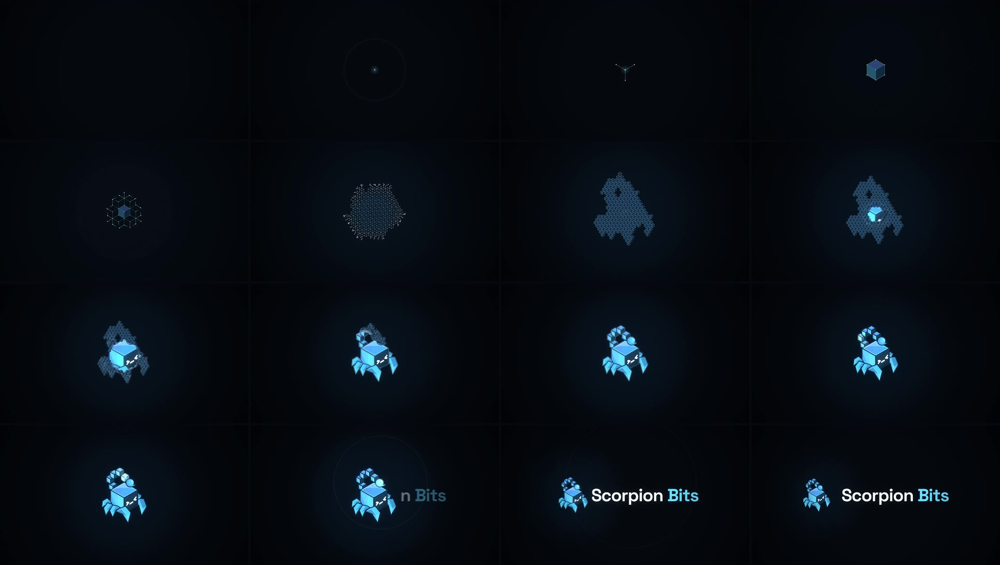

# Scorpion Bits: ident

**▶ [`scorpionbits-ident.mp4`](../scorpionbits-ident.mp4)** · 10.000 s · 1920×1080 · 60 fps · stereo 48 kHz
· also [`scorpionbits-ident-30fps.mp4`](../scorpionbits-ident-30fps.mp4) · sonic logo alone: [`sonic-logo.wav`](sonic-logo.wav)



This is the studio's audiovisual signature, made to open every lesson. It is one continuous transformation with no cuts, built entirely in code. Every frame is a pure function of time, and every sound is synthesised sample by sample from the **same clock** (`timeline.js`). The only external assets are the official mark (`brand/logo-mark.png`, taken unmodified from [`scorpion-bits/scorpion-bits.github.io`](https://github.com/scorpion-bits/scorpion-bits.github.io)) and the site's own typeface.

## The idea: a bit becomes a world

The mark is already made of bits. It is an isometric cube with five cube-bits for a tail. The ident follows that literally, and in the order a game is made: **point → bit → system → blockout → final art → signal → name.**

| Time | | Picture | Sound |
|---|---|---|---|
| 0:00.10 | **The signal** | One point of light on black. | A tiny digital pulse (A6). |
| 0:00.75 | | It pulses once. A ripple runs through an invisible isometric grid and lights it for an instant. | Soft low thump, a ping, the ripple's air. |
| 0:01.18 | | It inhales. | A short reverse swell. |
| 0:01.50 | **The system** | Three points shoot out: a **Y**. | Three clicks. |
| 0:01.75 | | The hexagon closes. The Y and hexagon are **an isometric cube, the studio's bit**, and it briefly takes the cube's three brand tones. | Three ticks and the first *bit* tone (A5). |
| 0:02.00–3.05 | | The lattice grows outward from that cube, node by node, along true 30° isometric lines, accelerating. Every node is born from a neighbour. Every new connection draws itself. The plane leans away (depth, parallax) as the camera pulls back. | Every node clicks and every connection ticks. One cue per growth step forms an accelerating, climbing arpeggio. The clicks thicken into texture. |
| 0:02.75–3.35 | | The growth is bounded by the mark's silhouette, so the system organises into a **blockout**: a voxel scorpion. | Warm tones rise from below. |
| 0:03.30–5.00 | **The transformation** | A wave starts from the first point and refines the blockout into the final art, **bit by bit**. Each lattice cell dissolves into light that settles exactly onto the mark's pixels. Each lattice node leaves on a curved, magnetic path for a point on the mark's own outline, and the old connections stretch and dissolve as the outline's lines light up. Body, then legs, then the five tail bits in order, the stinger last. | 16ths become 32nds, with a pulsing low A and a heartbeat. Hundreds of ticks as lines connect. The five tail bits each play their note as they form: the motif, heard quietly for the first time. |
| 0:05.00 | **The reveal** | The mark is whole: the official PNG, pixel for pixel. Its outline lights once and settles. | The completion hit. |
| 0:05.14 | | One light passes through the mark. | Air. |
| 0:05.75 | | A pulse leaves the first point and runs up the tail, lighting each bit in turn (one per 16th from 5.875 s)… | **The sonic logo:** E5 A5 B5 E6 C♯6 in 16ths. |
| **0:06.50** | **The signature** | …and reaches the stinger. One restrained ring. The mark moves into the lockup, and **Scorpion Bits** slides out from behind it and settles with a hair of overshoot. | **The impact:** low A, a warm A add9, a glassy A on top. |
| 0:07.70 | **The ending** | Complete stillness. The halo breathes almost imperceptibly, with a little dust. | One residual tone that breathes and fades. |
| 0:08.85 | | The first point glints once, inside the mark, exactly where it started. | The opening pulse, once more. |
| 0:10.00 | | Clean final frame: the lockup. | Silence. |

Played backwards, the ident reads mark → system → particles → point. That loop is what keeps it watchable the hundredth time.

### The sonic logo

The five tail bits climb up and over and come back down to the stinger. The melody traces the same contour: **E5 → A5 → B5 → E6 → C♯6**, rising to the top bit and falling to the last, then resolving on **A (add9)** at the stinger. It is the shape of the logo, made audible. The timbre is a pure tone with a glassy FM partial and a whisper of a pulse wave, the "game" in it. The motif is foreshadowed softly as the tail forms (4.375–4.875 s) and stated for real at 5.875 s. `sonic-logo.wav` (3.4 s) is the signature on its own, for reuse anywhere.

## How the mark is built without being redrawn

`geometry.py` reads `brand/logo-mark.png` and derives everything from its pixels:

- **Line art:** the centreline (skeleton) of the mark's own dark outline colour `#0f2538`, as a graph of 617 points. This is the structure the nodes converge onto.
- **Lattice:** a true isometric grid (the geometry of the studio's cube asset), rooted at the body cube's front vertex. The 216 cubes that fall at least half inside the mark form the blockout: 731 nodes and 1,379 edges.
- **Morph:** an optimal one-to-one assignment (minimum total squared travel) of lattice nodes to line-art points.
- **Wave:** the geodesic distance from the first point *through* the mark. The tail chain is cut from the body so the wave climbs the tail bit by bit. The distance → time mapping puts the five tail bits on the 16th-note grid, and the reveal is quantised to lattice cells.

Output: `geometry.js` (graph and assignment) and `data.png` (per-pixel wave distance and region labels). Both are committed; regenerate them with `pip install pillow numpy scipy scikit-image skan && python3 geometry.py`.

The mark itself is only ever shown as the official image: revealed through a per-pixel mask of its own pixels, lit additively, and moved or scaled uniformly. From 5.00 s on it is drawn straight from the PNG.

**Lockup.** This follows the site header (`.dock-brand`): the mark at 31/16 of the font size, a 10/16 em gap, Space Grotesk 700 at −0.03 em, and "Bits" in the site's cyan `#6ad8fe`. The name is set as one phrase with a normal word space, as on the site's cover image. The colour mark is used rather than the header's small white glyph, because the brand colour is the point of the ident.

**Palette:** ink `#05090f` and text `#eef5fb` from the site's CSS; cyan `#6ad8fe`; the mark's own colours. Restrained: black → a subtle cyan system → the brand colour → white light for the reveal and the name.

## Using it

- Put it at the head of each lesson. The last frame is the clean lockup, so cutting from it straight into the lesson (or holding it) works.
- 60 fps master; a native 30 fps render exists for 30 fps timelines. Both are BT.709 and exactly 10.000 s.
- Audio: −15.3 LUFS integrated, −1 dBFS peak, about the level of course voice-over, so it doesn't jump out. `sonic-logo.wav` plays at exactly the level it has inside the ident.
- `stills/final-frame.png` is the last frame (the lockup) as a lossless still, for thumbnails or for holding under a title.

## Run it

```bash
cd ident
node audio.mjs                 # soundtrack.wav   (~1 s)
node audio.mjs --signature     # sonic-logo.wav
node render.mjs                # .work/master-60.mp4  (headless Chromium, 600 frames × 5 motion-blur sub-frames, < 2 min on 4 cores)
./encode.sh                    # ../scorpionbits-ident.mp4
node render.mjs --fps 30 && FPS=30 ./encode.sh
npx serve .                    # index.html plays it live in the browser, with sound
```

For quick checks, `node render.mjs --stills 1.8,4.2,9.9 --sub 1` writes PNG stills, and `--sheet 3.3,5 --n 15` writes a contact sheet.

Space Grotesk is under the SIL Open Font License (`fonts/`). The mark belongs to Scorpion Bits.
